# メモパッドアプリケーション - 技術フローチャート

このドキュメントは、メモパッドアプリケーションの技術的なロジックと処理フローを詳細に図解したものです。

## 目次

1. [システムアーキテクチャ](#1-システムアーキテクチャ)
2. [アプリケーション初期化フロー](#2-アプリケーション初期化フロー)
3. [認証システムフロー](#3-認証システムフロー)
4. [ルーティング・認証ガードフロー](#4-ルーティング認証ガードフロー)
5. [メモCRUD操作フロー](#5-メモcrud操作フロー)
6. [Firestoreリアルタイム同期フロー](#6-firestoreリアルタイム同期フロー)
7. [状態管理フロー（Pinia）](#7-状態管理フローpinia)
8. [コンポーネント階層図](#8-コンポーネント階層図)
9. [データフローダイアグラム](#9-データフローダイアグラム)

---

## 1. システムアーキテクチャ

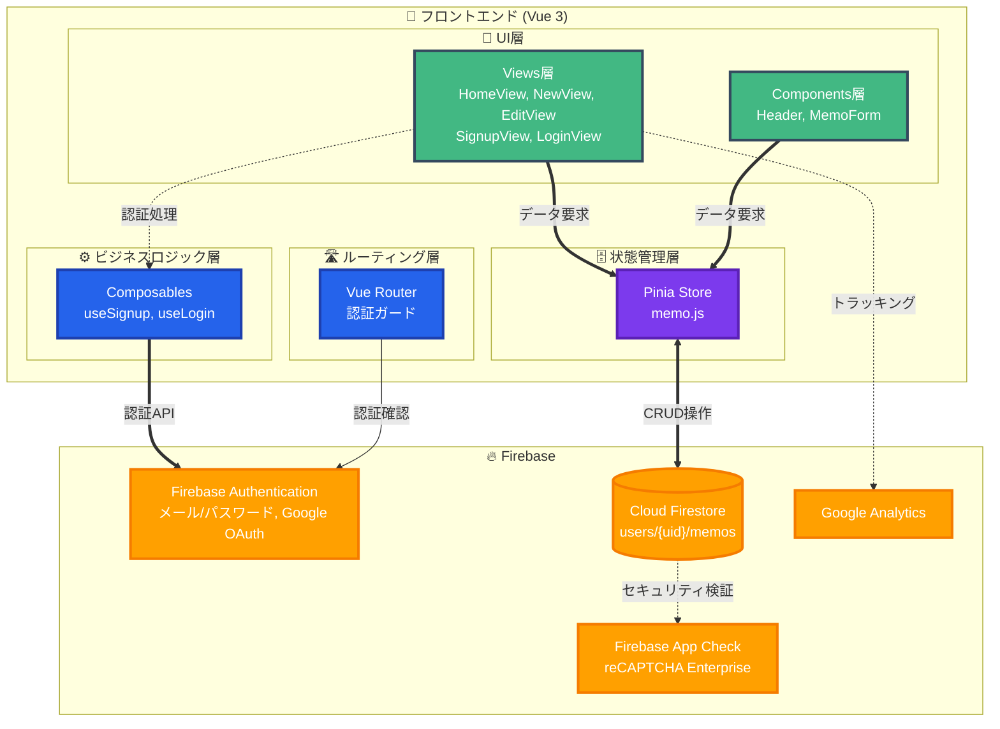

### レイヤー構造説明

| レイヤー | 役割 | 主要ファイル |
|---------|------|------------|
| **UI層** | ユーザーインターフェース表示 | Views/, Components/ |
| **状態管理層** | アプリケーション状態の一元管理 | store/memo.js |
| **ビジネスロジック層** | 認証・ビジネスロジック処理 | firebase/useSignup.js, useLogin.js |
| **ルーティング層** | ページ遷移・認証ガード | router/index.js |
| **データアクセス層** | Firebase SDKとの通信 | firebase/main.js |

---

## 2. アプリケーション初期化フロー

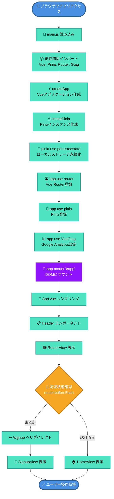

### 初期化処理の詳細

#### main.js:1-24

```javascript
// 1. スタイルシートのインポート
import '@/assets/main.scss'

// 2. Vue関連のインポート
import { createApp } from 'vue'
import { createPinia } from 'pinia'
import piniaPluginPersistedstate from 'pinia-plugin-persistedstate'

// 3. アプリケーションとルーター
import App from './App.vue'
import router from './router'
import VueGtag from 'vue-gtag-next'

// 4. アプリケーション初期化
const app = createApp(App)        // Vueアプリ作成
const pinia = createPinia()        // Pinia作成
pinia.use(piniaPluginPersistedstate) // 永続化プラグイン

// 5. プラグイン登録
app.use(router)  // ルーター
app.use(pinia)   // 状態管理
app.use(VueGtag, { property: { id: 'G-0F3BTMEC0V', router } }) // アナリティクス

// 6. マウント
app.mount('#app')
```

---

## 3. 認証システムフロー

### 3.1 サインアップフロー（メール/パスワード）

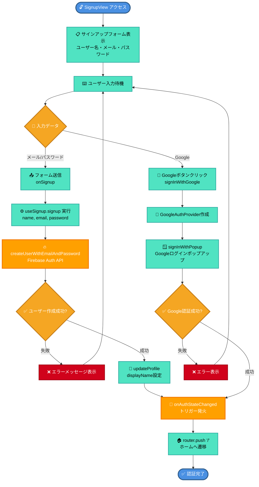

### 3.2 ログインフロー（メール/パスワード）

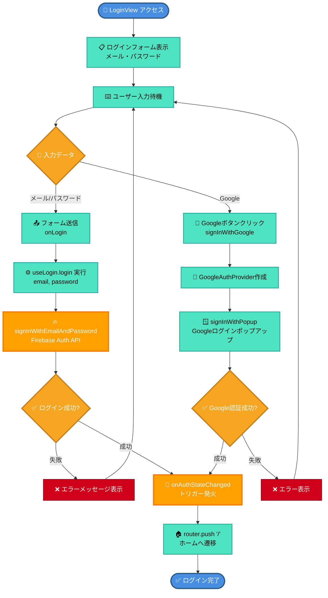

### 3.3 ログアウトフロー

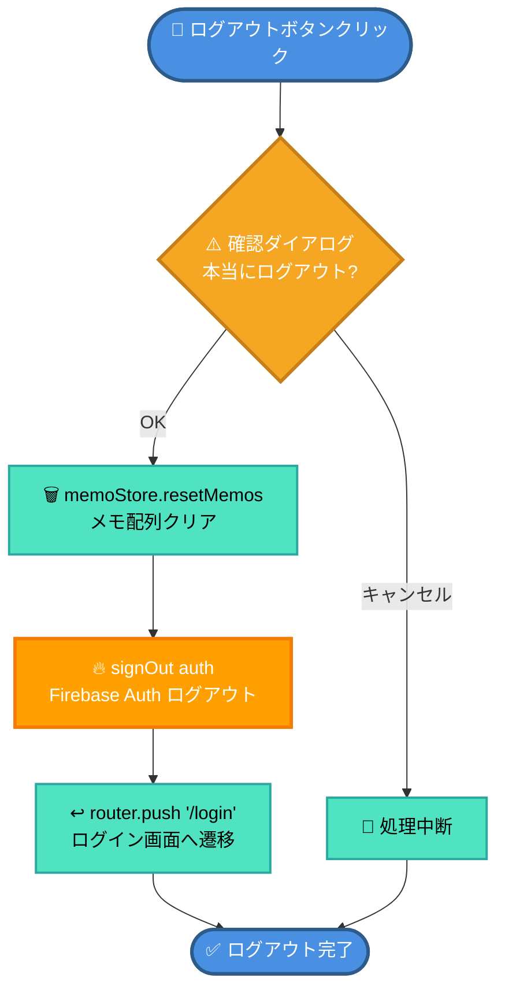

### 3.4 アカウント削除フロー

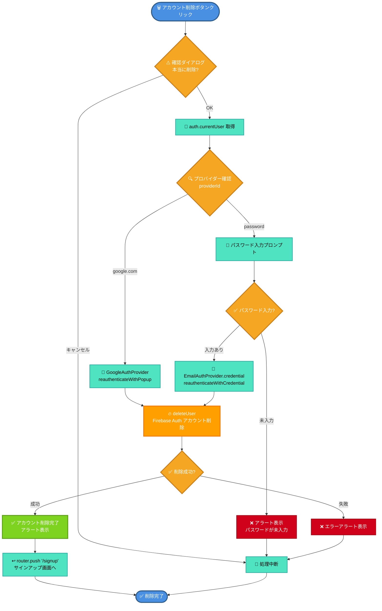

---

## 4. ルーティング・認証ガードフロー

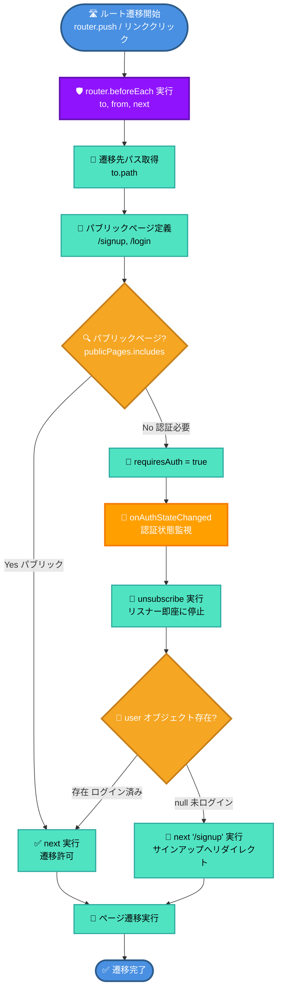

---

## 5. メモCRUD操作フロー

### 5.1 メモ作成フロー（Create）

```mermaid
flowchart TD
    Start([➕ 新規作成ボタンクリック])
    Navigate[🛣️ router.push '/new']
    LoadNewView[📄 NewView コンポーネント表示]
    RenderMemoForm[📝 MemoForm レンダリング<br/>props.memo = empty]
    InitForm[🎨 フォーム初期化<br/>title = '', content = '']
    UserInput[⌨️ ユーザー入力待機]
    Action{🎯 ユーザー操作}
    ValidateInput{✅ 入力検証<br/>title OR content}
    CancelAction[🚫 router.push '/']
    ShowAlert[⚠️ アラート表示<br/>入力してください]
    PrepareData[📦 modMemo 作成<br/>title, content]
    CheckEdit{🔍 isEdit.value<br/>route.name === 'edit'}
    CallCreate[⚙️ memoStore.createMemo<br/>modMemo]
    GetCurrentUser[👤 auth.currentUser 取得]
    CheckUser{✅ user 存在?}
    ReturnEarly[🛑 処理終了]
    GetMemosRef[📂 collection<br/>users/uid/memos]
    GetSnapshot[📊 getDocs memosRef<br/>既存メモ全件取得]
    CalcMaxId[🔢 最大 numericId 計算<br/>maxNumericId = 0]
    PrepareDoc[📋 ドキュメントデータ作成<br/>numericId, title, content<br/>createDate, updateDate]
    AddDoc[🔥 addDoc memosRef<br/>Firestore に追加]
    TriggerSnapshot[🔔 onSnapshot が変更検知]
    AutoUpdate[🔄 state.memos 自動更新<br/>HomeView 自動再レンダリング]
    RouterPush[🏠 router.push '/'<br/>ホームへ遷移]
    End([✅ 処理終了])

    Start --> Navigate --> LoadNewView --> RenderMemoForm --> InitForm --> UserInput --> Action
    Action -->|保存ボタン| ValidateInput
    Action -->|キャンセルボタン| CancelAction
    ValidateInput -->|空欄| ShowAlert --> UserInput
    ValidateInput -->|入力あり| PrepareData --> CheckEdit
    CheckEdit -->|false 新規作成| CallCreate --> GetCurrentUser --> CheckUser
    CheckUser -->|存在しない| ReturnEarly --> End
    CheckUser -->|存在| GetMemosRef --> GetSnapshot --> CalcMaxId --> PrepareDoc
    PrepareDoc --> AddDoc --> TriggerSnapshot --> AutoUpdate --> RouterPush --> End
    CancelAction --> RouterPush

    classDef startEnd fill:#4A90E2,stroke:#2E5C8A,stroke-width:3px,color:#fff
    classDef process fill:#50E3C2,stroke:#2BA89F,stroke-width:2px,color:#000
    classDef decision fill:#F5A623,stroke:#C77F1B,stroke-width:3px,color:#fff
    classDef firebase fill:#FFA000,stroke:#F57C00,stroke-width:3px,color:#fff
    classDef store fill:#9013FE,stroke:#6610B8,stroke-width:3px,color:#fff
    classDef warning fill:#FF9500,stroke:#CC7700,stroke-width:2px,color:#fff

    class Start,End startEnd
    class Navigate,LoadNewView,RenderMemoForm,InitForm,UserInput,PrepareData,GetCurrentUser,GetMemosRef,GetSnapshot,CalcMaxId,PrepareDoc,RouterPush,CancelAction,ReturnEarly process
    class Action,ValidateInput,CheckEdit,CheckUser decision
    class AddDoc,TriggerSnapshot firebase
    class CallCreate,AutoUpdate store
    class ShowAlert warning
```

### 5.2 メモ読取フロー（Read）

```mermaid
flowchart TD
    Start([📖 HomeView 表示])
    OnMounted[🎬 onMounted フック実行]
    ResetMemos[🗑️ memoStore.resetMemos<br/>state.memos = empty]
    SetupAuthListener[🔔 onAuthStateChanged<br/>認証状態監視設定]
    CheckAuthState{👤 user 存在?}
    StopListener[🛑 stopRealtimeListener<br/>resetMemos]
    StartListener[▶️ startRealtimeListener]
    CheckExistingListener{🔍 unsubscribe 存在?}
    UnsubOld[🛑 unsubscribe 実行<br/>既存リスナー停止]
    CreateRef[📂 collection<br/>users/uid/memos]
    CreateQuery[🔍 query memosRef<br/>orderBy createDate desc]
    SetupSnapshot[🔔 onSnapshot 設定<br/>snapshot, error]
    StoreUnsub[💾 this.unsubscribe 保存<br/>onSnapshot 戻り値]
    ListenChanges[👂 Firestore 変更監視開始]
    WaitEvent{⏳ 変更イベント待機}
    MapDocs[🗺️ snapshot.docs.map<br/>各ドキュメント処理]
    ExtractData[📊 データ抽出<br/>id, numericId, ...data]
    UpdateState[🔄 this.memos = 配列<br/>state 更新]
    TriggerReactive[⚡ Vue リアクティブシステム発動]
    UpdateView[🎨 computed 更新<br/>テンプレート自動再レンダリング]
    DisplayCheck{📊 memoCount > 0}
    ShowEmpty[📭 空状態表示<br/>メモがありません]
    ShowList[📜 v-for memo in memos<br/>メモリスト表示]
    WaitUserAction[⌛ ユーザー操作待機]
    HandleError[❌ console.error<br/>Firestore listener error]
    OnUnmounted[🏁 onUnmounted フック]
    Cleanup[🧹 unsubscribeAuth 実行<br/>stopRealtimeListener 実行]
    End([✅ 表示完了])

    Start --> OnMounted --> ResetMemos --> SetupAuthListener --> CheckAuthState
    CheckAuthState -->|存在しない 未ログイン| StopListener
    CheckAuthState -->|存在 ログイン済み| StartListener --> CheckExistingListener
    CheckExistingListener -->|存在| UnsubOld --> CreateRef
    CheckExistingListener -->|存在しない| CreateRef
    CreateRef --> CreateQuery --> SetupSnapshot --> StoreUnsub --> ListenChanges --> WaitEvent
    WaitEvent -->|データ変更| MapDocs --> ExtractData --> UpdateState --> TriggerReactive
    TriggerReactive --> UpdateView --> DisplayCheck
    DisplayCheck -->|0件| ShowEmpty --> WaitUserAction
    DisplayCheck -->|1件以上| ShowList --> WaitUserAction
    WaitEvent -->|エラー| HandleError --> WaitEvent
    StopListener --> OnUnmounted --> Cleanup --> End
    WaitUserAction --> End

    classDef startEnd fill:#4A90E2,stroke:#2E5C8A,stroke-width:3px,color:#fff
    classDef process fill:#50E3C2,stroke:#2BA89F,stroke-width:2px,color:#000
    classDef decision fill:#F5A623,stroke:#C77F1B,stroke-width:3px,color:#fff
    classDef firebase fill:#FFA000,stroke:#F57C00,stroke-width:3px,color:#fff
    classDef store fill:#9013FE,stroke:#6610B8,stroke-width:3px,color:#fff
    classDef error fill:#D0021B,stroke:#9B0115,stroke-width:2px,color:#fff

    class Start,End startEnd
    class OnMounted,ResetMemos,UnsubOld,CreateRef,CreateQuery,StoreUnsub,MapDocs,ExtractData,ShowEmpty,ShowList,WaitUserAction,OnUnmounted,Cleanup,StopListener process
    class CheckAuthState,CheckExistingListener,WaitEvent,DisplayCheck decision
    class SetupAuthListener,SetupSnapshot,ListenChanges firebase
    class UpdateState,TriggerReactive,UpdateView,StartListener store
    class HandleError error
```

### 5.3 メモ更新フロー（Update）

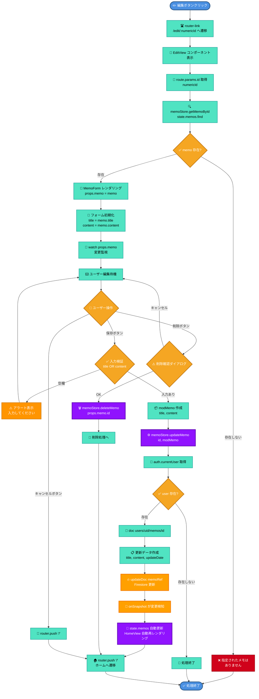

### 5.4 メモ削除フロー（Delete）

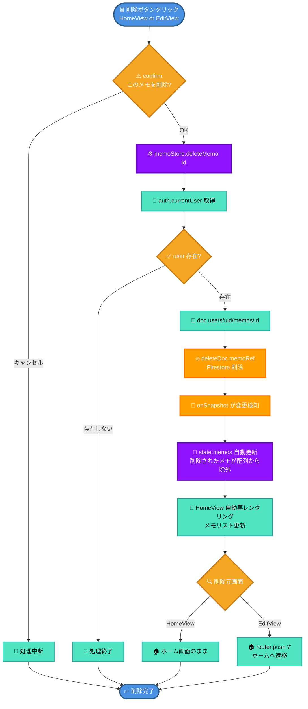

---

## 6. Firestoreリアルタイム同期フロー

```mermaid
flowchart TD
    Start([▶️ startRealtimeListener 実行<br/>HomeView.onMounted])
    GetUser[👤 auth.currentUser 取得]
    CheckUser{✅ user 存在?}
    ReturnEarly[🛑 return<br/>処理終了]
    CheckListener{🔍 this.unsubscribe<br/>既存リスナー存在?}
    Unsubscribe[🛑 this.unsubscribe 実行<br/>既存リスナー停止]
    NullUnsub[❌ this.unsubscribe = null]
    CreateRef[📂 collection<br/>users/uid/memos]
    CreateQuery[🔍 query memosRef<br/>orderBy createDate desc]
    SetupSnapshot[🔔 onSnapshot<br/>snapshot, error]
    StoreUnsub[💾 this.unsubscribe<br/>onSnapshot 戻り値関数]
    ListenStart[👂 Firestore 監視開始]
    WaitEvent{⏳ イベント待機}
    OnAdd[➕ ドキュメント追加<br/>新規ドキュメント]
    OnModify[✏️ ドキュメント変更<br/>変更ドキュメント]
    OnRemove[🗑️ ドキュメント削除<br/>削除ドキュメント欠落]
    OnError[❌ error コールバック実行]
    MapDocs[🗺️ snapshot.docs.map]
    ForEachDoc[🔄 各 doc に対して]
    ExtractId[🆔 id: doc.id]
    ExtractNumericId[🔢 numericId: doc.data.numericId]
    SpreadData[📊 ...doc.data<br/>すべてのフィールド展開]
    BuildArray[📦 新しい配列構築]
    UpdateState[🔄 this.memos = 新配列<br/>state 完全置換]
    TriggerReactive[⚡ Vue リアクティブシステム<br/>変更検知]
    UpdateComputed[🔢 computed memos 再計算<br/>computed memoCount 再計算]
    ReRender[🎨 HomeView テンプレート<br/>自動再レンダリング]
    DisplayList[📜 v-for memo in memos<br/>最新のメモリスト表示]
    LogError[📝 console.error<br/>Firestore listener error]
    End([🏁 監視終了])
    StopCall[🛑 stopRealtimeListener 呼び出し]
    CheckStopUnsub{🔍 this.unsubscribe 存在?}
    CallUnsub[🛑 this.unsubscribe 実行]
    SkipStop[⏭️ 何もしない]
    NullStop[❌ this.unsubscribe = null]

    Start --> GetUser --> CheckUser
    CheckUser -->|存在しない| ReturnEarly --> End
    CheckUser -->|存在| CheckListener
    CheckListener -->|存在| Unsubscribe --> NullUnsub --> CreateRef
    CheckListener -->|存在しない| CreateRef
    CreateRef --> CreateQuery --> SetupSnapshot --> StoreUnsub --> ListenStart --> WaitEvent
    WaitEvent -->|ドキュメント追加| OnAdd --> MapDocs
    WaitEvent -->|ドキュメント変更| OnModify --> MapDocs
    WaitEvent -->|ドキュメント削除| OnRemove --> MapDocs
    WaitEvent -->|エラー発生| OnError --> LogError --> WaitEvent
    MapDocs --> ForEachDoc --> ExtractId --> ExtractNumericId --> SpreadData
    SpreadData --> BuildArray --> UpdateState --> TriggerReactive --> UpdateComputed
    UpdateComputed --> ReRender --> DisplayList --> WaitEvent
    StopCall -.->|外部から呼び出し| CheckStopUnsub
    CheckStopUnsub -.->|存在| CallUnsub -.-> NullStop -.-> End
    CheckStopUnsub -.->|存在しない| SkipStop -.-> End

    classDef startEnd fill:#4A90E2,stroke:#2E5C8A,stroke-width:3px,color:#fff
    classDef process fill:#50E3C2,stroke:#2BA89F,stroke-width:2px,color:#000
    classDef decision fill:#F5A623,stroke:#C77F1B,stroke-width:3px,color:#fff
    classDef firebase fill:#FFA000,stroke:#F57C00,stroke-width:3px,color:#fff
    classDef store fill:#9013FE,stroke:#6610B8,stroke-width:3px,color:#fff
    classDef event fill:#00BCD4,stroke:#0097A7,stroke-width:2px,color:#fff
    classDef error fill:#D0021B,stroke:#9B0115,stroke-width:2px,color:#fff

    class Start,End startEnd
    class GetUser,Unsubscribe,NullUnsub,CreateRef,CreateQuery,StoreUnsub,MapDocs,ForEachDoc,ExtractId,ExtractNumericId,SpreadData,BuildArray,ReRender,DisplayList,ReturnEarly,CallUnsub,SkipStop,NullStop,StopCall process
    class CheckUser,CheckListener,WaitEvent,CheckStopUnsub decision
    class SetupSnapshot,ListenStart firebase
    class UpdateState,TriggerReactive,UpdateComputed store
    class OnAdd,OnModify,OnRemove event
    class OnError,LogError error
```

### リアルタイム同期の重要ポイント

1. **onSnapshot の仕組み**
   - Firestoreのクエリ結果が変更されるたびに自動的にコールバックが実行される
   - 追加・更新・削除のいずれの変更も検知

2. **リスナーのライフサイクル**
   - `onMounted`: リスナー開始
   - `onUnmounted`: リスナー停止（メモリリーク防止）

3. **認証状態との連携**
   - ログイン時: リスナー開始
   - ログアウト時: リスナー停止 + メモクリア

---

## 7. 状態管理フロー（Pinia）

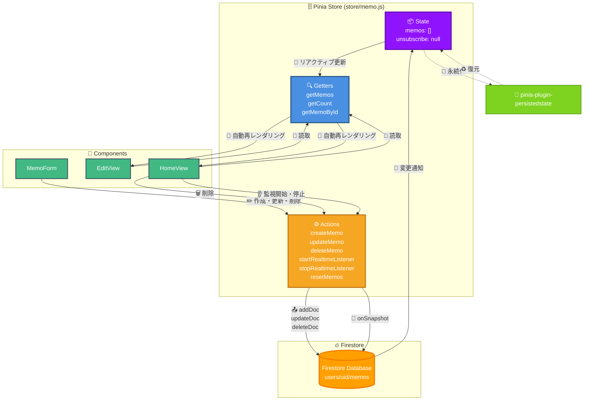

### Pinia Store 詳細構造

#### state (状態)

```javascript
state: () => ({
  memos: [],           // メモ配列
  unsubscribe: null,   // Firestore リスナー停止関数
})
```

#### getters (算出プロパティ)

```javascript
getters: {
  getMemos(state) {
    return state.memos  // すべてのメモを返す
  },
  getCount(state) {
    return state.memos.length  // メモ件数
  },
  getMemoById(state) {
    return (id) => state.memos.find(
      (memo) => memo.numericId === parseInt(id)
    )  // IDでメモを検索
  },
}
```

#### actions (メソッド)

| アクション | 説明 | Firebase API |
|-----------|------|-------------|
| `createMemo(memo)` | メモ作成 | `addDoc()` |
| `updateMemo(id, modMemo)` | メモ更新 | `updateDoc()` |
| `deleteMemo(id)` | メモ削除 | `deleteDoc()` |
| `startRealtimeListener()` | リアルタイム監視開始 | `onSnapshot()` |
| `stopRealtimeListener()` | リアルタイム監視停止 | `unsubscribe()` |
| `resetMemos()` | メモ配列クリア | - |

---

## 8. コンポーネント階層図

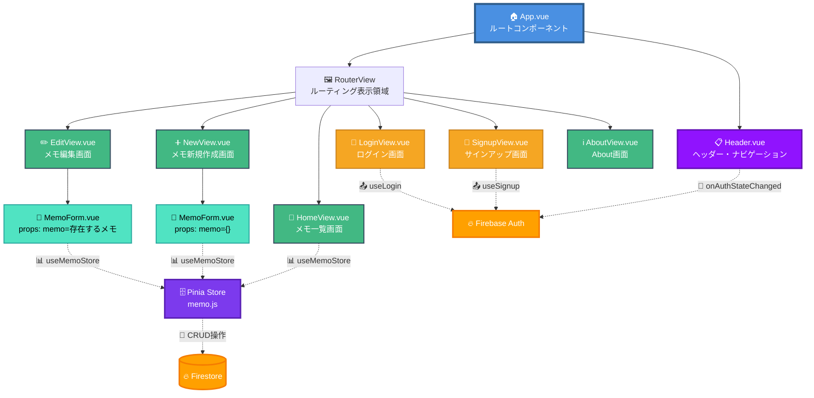

### コンポーネント責務一覧

| コンポーネント | 責務 | 使用するStore/Composable |
|--------------|------|------------------------|
| **App.vue** | アプリケーション全体の構造 | - |
| **Header.vue** | ヘッダー表示、ログアウト、アカウント削除 | Firebase Auth |
| **HomeView.vue** | メモ一覧表示、削除、リアルタイム監視 | useMemoStore |
| **NewView.vue** | MemoFormをラップ（新規作成モード） | - |
| **EditView.vue** | MemoFormをラップ（編集モード） | useMemoStore (getMemoById) |
| **MemoForm.vue** | メモ入力フォーム、保存・削除ロジック | useMemoStore |
| **SignupView.vue** | サインアップフォーム | useSignup |
| **LoginView.vue** | ログインフォーム | useLogin |

---

## 9. データフローダイアグラム

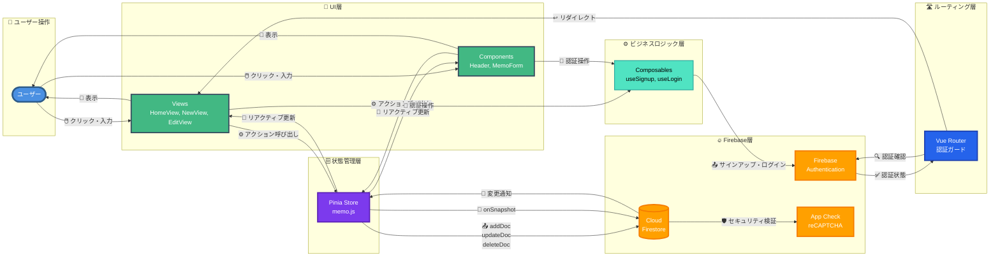

### データフローの流れ

#### 1. ユーザー操作 → UI更新（読取）

```
👤 User → 📱 Views → 🔍 Pinia.getters → 🧮 computed → 🎨 テンプレート再レンダリング
```

#### 2. ユーザー操作 → データ作成（書込）

```
👤 User → 📝 MemoForm → ⚙️ Pinia.createMemo → 🔥 Firestore.addDoc → 🔔 onSnapshot → 🔄 Pinia.state更新 → 🎨 UI自動更新
```

#### 3. ユーザー操作 → データ更新（書込）

```
👤 User → 📝 MemoForm → ⚙️ Pinia.updateMemo → 🔥 Firestore.updateDoc → 🔔 onSnapshot → 🔄 Pinia.state更新 → 🎨 UI自動更新
```

#### 4. ユーザー操作 → データ削除（書込）

```
👤 User → 🗑️ HomeView/MemoForm → ⚙️ Pinia.deleteMemo → 🔥 Firestore.deleteDoc → 🔔 onSnapshot → 🔄 Pinia.state更新 → 🎨 UI自動更新
```

#### 5. 認証フロー

```
👤 User → 📝 SignupView/LoginView → ⚙️ useSignup/useLogin → 🔥 Firebase Auth → 🔔 onAuthStateChanged → 🛡️ Router Guard → 📱 Views
```

---

## まとめ

### システムの特徴

1. **リアクティブなデータフロー**
   - Firestoreの変更がPiniaを経由して自動的にUIに反映される
   - 手動でのデータ再取得が不要

2. **認証ベースのアクセス制御**
   - Router Guardによる未認証アクセスの防止
   - ユーザーごとにデータが分離（users/{uid}/memos）

3. **状態管理の永続化**
   - Piniaとpersisted-state pluginによるローカルストレージ保存
   - ページリロード後も状態が維持される

4. **セキュリティ**
   - Firebase App Check（reCAPTCHA Enterprise）
   - Firestoreセキュリティルール
   - 認証トークンの自動更新

### 技術スタック

- **フロントエンド**: Vue 3 (Composition API)
- **状態管理**: Pinia + pinia-plugin-persistedstate
- **ルーティング**: Vue Router
- **認証**: Firebase Authentication
- **データベース**: Cloud Firestore
- **セキュリティ**: Firebase App Check
- **アナリティクス**: Google Analytics (vue-gtag-next)
- **ビルドツール**: Vite
- **スタイリング**: SCSS

---

## ファイルマップ

| パス | 役割 |
|------|------|
| `src/main.js` | アプリケーションエントリーポイント |
| `src/App.vue` | ルートコンポーネント |
| `src/router/index.js` | ルーティング設定・認証ガード |
| `src/store/memo.js` | Piniaストア（メモCRUD + リアルタイム監視） |
| `src/firebase/main.js` | Firebase初期化 |
| `src/firebase/useSignup.js` | サインアップComposable |
| `src/firebase/useLogin.js` | ログインComposable |
| `src/views/HomeView.vue` | メモ一覧画面 |
| `src/views/NewView.vue` | メモ新規作成画面 |
| `src/views/EditView.vue` | メモ編集画面 |
| `src/views/SignupView.vue` | サインアップ画面 |
| `src/views/loginView.vue` | ログイン画面 |
| `src/components/Header.vue` | ヘッダーコンポーネント |
| `src/components/MemoForm.vue` | メモフォームコンポーネント |

---

**作成日**: 2025年10月19日
**バージョン**: 2.0.0
**デザイン**: Enhanced with icons, colors, and better visual hierarchy
