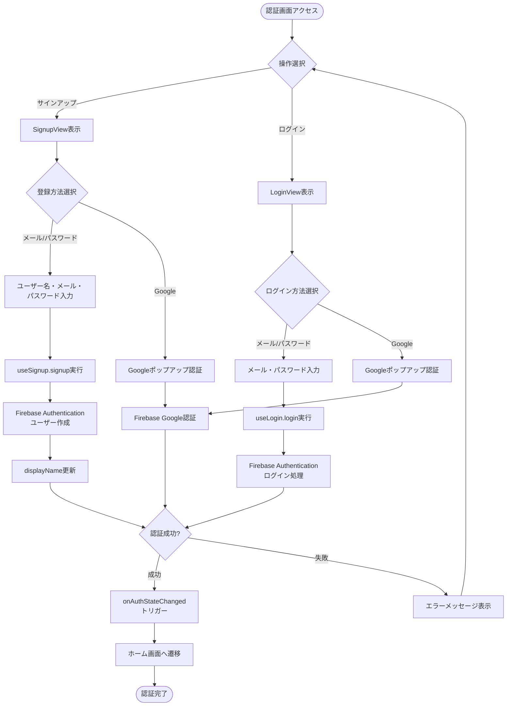
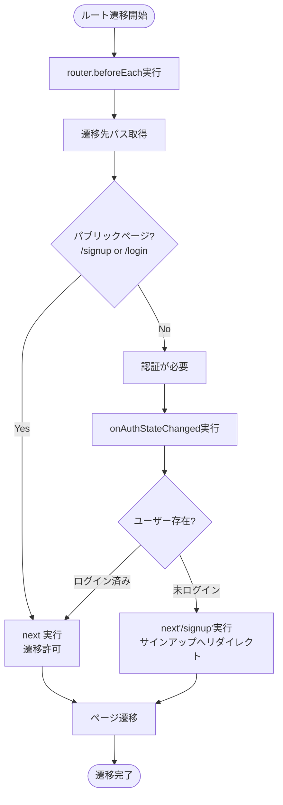
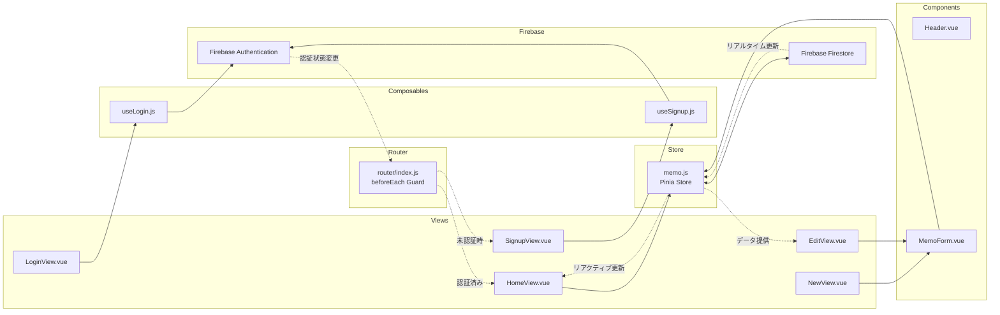

# メモパッド（memopad）

https://memopad-85160.web.app/

## 概要

このプロジェクトは、Vue.jsを用いて作成されたシンプルなメモパッドアプリケーションです。
メモの作成・編集・削除ができ、日々のアイデアやタスクを手軽に管理できます。

## 技術スタック

- **フロントエンド**: Vue 3 (Composition API)
- **状態管理**: Pinia (pinia-plugin-persistedstate)
- **ルーティング**: Vue Router
- **認証**: Firebase Authentication
- **データベース**: Firebase Firestore
- **セキュリティ**: Firebase App Check (reCAPTCHA Enterprise)
- **アナリティクス**: Google Analytics (vue-gtag-next)
- **スタイリング**: SCSS
- **ビルドツール**: Vite

## 主要機能

- ✅ ユーザー認証（メール/パスワード、Google認証）
- ✅ メモのリアルタイム同期
- ✅ メモの作成・編集・削除（CRUD操作）
- ✅ 自動ID採番システム
- ✅ ローカルストレージへのデータ永続化
- ✅ 認証ガード（未認証時の自動リダイレクト）

---

## アーキテクチャとフロー図

### 1. アプリケーション全体のフロー

```mermaid
flowchart TD
    Start([アプリ起動]) --> Init[main.js: アプリ初期化]
    Init --> CreateApp[Vue App作成]
    CreateApp --> SetupPinia[Pinia設定<br/>persistedstate有効化]
    SetupPinia --> SetupRouter[Router設定]
    SetupRouter --> SetupGtag[Google Analytics設定]
    SetupGtag --> MountApp[App.vueマウント]
    MountApp --> RenderHeader[Headerコンポーネント表示]
    RenderHeader --> CheckAuth{認証状態確認}

    CheckAuth -->|未ログイン| CheckRoute{アクセスルート確認}
    CheckRoute -->|/signup or /login| AllowAccess[アクセス許可]
    CheckRoute -->|その他| RedirectSignup[/signupへリダイレクト]

    CheckAuth -->|ログイン済み| LoadView[ビュー表示]
    AllowAccess --> LoadView
    RedirectSignup --> LoadView

    LoadView --> RouterView[RouterViewで<br/>各ビュー表示]
    RouterView --> End([ユーザー操作待機])
```

### 2. 認証フロー（サインアップ・ログイン）



### 3. ルーティング・認証ガードフロー



### 4. メモ一覧表示フロー（HomeView）

```mermaid
flowchart TD
    Start([HomeView表示]) --> OnMounted[onMounted実行]
    OnMounted --> ResetMemos[memoStore.resetMemos<br/>メモ配列クリア]
    ResetMemos --> SetupAuthListener[onAuthStateChanged設定]

    SetupAuthListener --> CheckAuthState{ユーザーログイン状態}

    CheckAuthState -->|ログイン済み| StartListener[startRealtimeListener実行]
    CheckAuthState -->|未ログイン| StopListener[stopRealtimeListener実行<br/>メモリセット]

    StartListener --> CheckExisting{既存リスナー存在?}
    CheckExisting -->|Yes| UnsubOld[既存リスナー停止]
    CheckExisting -->|No| CreateQuery[Firestoreクエリ作成]
    UnsubOld --> CreateQuery

    CreateQuery --> QueryPath[users/{uid}/memos]
    QueryPath --> OrderBy[createDate降順でソート]
    OrderBy --> OnSnapshot[onSnapshot設定<br/>リアルタイム監視開始]

    OnSnapshot --> WaitChanges{Firestoreデータ変更}
    WaitChanges -->|変更検知| UpdateState[stateのmemos更新]
    UpdateState --> RenderList[画面再レンダリング]
    RenderList --> WaitChanges

    RenderList --> DisplayCheck{メモ件数確認}
    DisplayCheck -->|0件| ShowEmpty[空状態メッセージ表示]
    DisplayCheck -->|1件以上| ShowList[メモリスト表示]

    ShowList --> UserAction{ユーザー操作}
    UserAction -->|新規作成| GoNew[/newへ遷移]
    UserAction -->|編集| GoEdit[/edit/:idへ遷移]
    UserAction -->|削除| ConfirmDelete{削除確認ダイアログ}

    ConfirmDelete -->|OK| CallDelete[deleteMemo実行]
    ConfirmDelete -->|キャンセル| WaitChanges

    CallDelete --> DeleteFirestore[Firestore削除処理]
    DeleteFirestore --> OnSnapshot

    ShowEmpty --> End([画面表示])
    GoNew --> End
    GoEdit --> End
```

### 5. メモ作成フロー（NewView → MemoForm）

```mermaid
flowchart TD
    Start([新規作成ボタンクリック]) --> Navigate[/newへ遷移]
    Navigate --> LoadNewView[NewView表示]
    LoadNewView --> RenderForm[MemoFormコンポーネント<br/>空のmemoオブジェクト渡し]

    RenderForm --> InitForm[フォーム初期化<br/>title・content空欄]
    InitForm --> UserInput[ユーザー入力待機]

    UserInput --> Action{ユーザー操作}

    Action -->|保存ボタン| Validate{入力検証}
    Action -->|キャンセル| Cancel[ホームへ遷移]

    Validate -->|空欄| ShowAlert[アラート表示:<br/>入力してください]
    Validate -->|入力あり| CreateMemo[createMemo実行]

    ShowAlert --> UserInput

    CreateMemo --> GetUser[現在のユーザー取得]
    GetUser --> GetMemosRef[Firestoreパス:<br/>users/{uid}/memos]
    GetMemosRef --> CalcId[最大numericId計算]
    CalcId --> PrepareData[メモデータ準備<br/>numericId+1, title, content<br/>createDate, updateDate]

    PrepareData --> AddDoc[addDoc実行<br/>Firestoreに追加]
    AddDoc --> TriggerSnapshot[onSnapshotが変更検知]
    TriggerSnapshot --> AutoUpdate[HomeViewのリストが<br/>自動更新される]

    AutoUpdate --> RedirectHome[ホームへ遷移]
    Cancel --> RedirectHome

    RedirectHome --> End([作成完了])
```

### 6. メモ編集フロー（EditView → MemoForm）

```mermaid
flowchart TD
    Start([編集ボタンクリック]) --> Navigate[/edit/:idへ遷移]
    Navigate --> LoadEditView[EditView表示]
    LoadEditView --> GetRouteId[route.params.idから<br/>numericId取得]

    GetRouteId --> FindMemo[getMemoById実行<br/>ストアから該当メモ検索]
    FindMemo --> CheckExists{メモ存在?}

    CheckExists -->|存在しない| ShowNotFound[指定されたメモは<br/>ありませんメッセージ]
    CheckExists -->|存在| RenderForm[MemoFormコンポーネント<br/>既存memoオブジェクト渡し]

    RenderForm --> InitForm[フォーム初期化<br/>既存のtitle・content設定]
    InitForm --> WatchMemo[watchでmemo変更監視]
    WatchMemo --> UserInput[ユーザー編集待機]

    UserInput --> Action{ユーザー操作}

    Action -->|保存ボタン| Validate{入力検証}
    Action -->|キャンセル| Cancel[ホームへ遷移]
    Action -->|削除ボタン| ConfirmDel{削除確認ダイアログ}

    Validate -->|空欄| ShowAlert[アラート表示]
    Validate -->|入力あり| UpdateMemo[updateMemo実行]

    ShowAlert --> UserInput

    UpdateMemo --> GetDocRef[Firestoreドキュメント参照:<br/>users/{uid}/memos/{id}]
    GetDocRef --> PrepareUpdate[更新データ準備<br/>title, content, updateDate]
    PrepareUpdate --> UpdateDoc[updateDoc実行<br/>Firestore更新]

    UpdateDoc --> TriggerSnapshot[onSnapshotが変更検知]
    TriggerSnapshot --> AutoUpdate[HomeViewのリストが<br/>自動更新される]

    ConfirmDel -->|OK| DeleteMemo[deleteMemo実行]
    ConfirmDel -->|キャンセル| UserInput

    DeleteMemo --> DeleteDoc[deleteDoc実行<br/>Firestore削除]
    DeleteDoc --> AutoUpdate

    AutoUpdate --> RedirectHome[ホームへ遷移]
    Cancel --> RedirectHome
    ShowNotFound --> End([処理終了])
    RedirectHome --> End
```

### 7. Firestoreリアルタイム監視フロー

```mermaid
flowchart TD
    Start([startRealtimeListener実行]) --> CheckUser{currentUser存在?}

    CheckUser -->|存在しない| ReturnEarly[処理終了]
    CheckUser -->|存在| CheckListener{既存リスナー存在?}

    CheckListener -->|Yes| Unsubscribe[既存リスナー停止<br/>unsubscribe 実行]
    CheckListener -->|No| CreateRef[Firestoreコレクション参照作成]
    Unsubscribe --> CreateRef

    CreateRef --> GetCollection[collection:<br/>users/{uid}/memos]
    GetCollection --> CreateQuery[query作成<br/>orderBy createDate desc]

    CreateQuery --> SetupSnapshot[onSnapshot設定]
    SetupSnapshot --> StoreUnsubscribe[unsubscribe関数を<br/>ストアに保存]

    StoreUnsubscribe --> ListenChanges[Firestore変更監視開始]

    ListenChanges --> WaitEvent{イベント待機}

    WaitEvent -->|データ追加| OnAdd[追加されたドキュメント検知]
    WaitEvent -->|データ更新| OnModify[変更されたドキュメント検知]
    WaitEvent -->|データ削除| OnDelete[削除されたドキュメント検知]
    WaitEvent -->|エラー| OnError[エラーハンドリング<br/>console.error出力]

    OnAdd --> MapDocs[snapshot.docsをmap処理]
    OnModify --> MapDocs
    OnDelete --> MapDocs

    MapDocs --> ExtractData[各ドキュメントから<br/>id, numericId, データ抽出]
    ExtractData --> UpdateState[state.memosを新配列で更新]

    UpdateState --> TriggerReactive[Vueリアクティブシステム発動]
    TriggerReactive --> UpdateAllViews[全ての関連コンポーネント<br/>自動更新]

    UpdateAllViews --> WaitEvent

    OnError --> WaitEvent

    ReturnEarly --> End([監視終了])

    Note[stopRealtimeListener実行時] -.->|呼び出し| CallUnsubscribe[unsubscribe実行]
    CallUnsubscribe -.-> StopListening[監視停止]
    StopListening -.-> End
```

### 8. コンポーネント間データフロー



---

## プロジェクト構造

```
memopad/
├── src/
│   ├── App.vue                 # ルートコンポーネント
│   ├── main.js                 # アプリケーションエントリーポイント
│   ├── assets/                 # スタイルシート
│   │   ├── _base.scss
│   │   └── main.scss
│   ├── components/             # 再利用可能なコンポーネント
│   │   ├── Header.vue          # ヘッダーコンポーネント
│   │   └── MemoForm.vue        # メモ作成・編集フォーム
│   ├── firebase/               # Firebase関連
│   │   ├── main.js             # Firebase初期化
│   │   ├── useLogin.js         # ログイン機能
│   │   └── useSignup.js        # サインアップ機能
│   ├── router/                 # ルーティング設定
│   │   └── index.js            # ルート定義・認証ガード
│   ├── store/                  # Pinia状態管理
│   │   └── memo.js             # メモストア（CRUD + リアルタイム監視）
│   └── views/                  # ページコンポーネント
│       ├── HomeView.vue        # メモ一覧画面
│       ├── NewView.vue         # メモ新規作成画面
│       ├── EditView.vue        # メモ編集画面
│       ├── SignupView.vue      # サインアップ画面
│       └── loginView.vue       # ログイン画面
├── public/                     # 静的ファイル
├── firebase.json               # Firebase設定
├── vite.config.js              # Vite設定
└── package.json                # 依存関係
```

---

## 主要な処理フローの説明

### **認証システム**

- Firebase Authenticationを使用
- メール/パスワード認証とGoogle OAuth対応
- `router.beforeEach`で全ルートに認証ガードを実装
- `/signup`と`/login`以外のページは認証必須
- 未認証時は自動的に`/signup`へリダイレクト

### **状態管理（Pinia）**

- `useMemoStore`でメモデータを一元管理
- `pinia-plugin-persistedstate`でローカルストレージに自動保存
- リアクティブな状態更新でUIが自動的に反映

### **リアルタイム同期**

- Firestoreの`onSnapshot`APIでデータ変更を監視
- ユーザーごとに`users/{uid}/memos`コレクションでデータ分離
- データ追加・更新・削除時に全画面が自動更新

### **メモのCRUD操作**

1. **作成（Create）**:
   - `createMemo` → 最大numericIDを計算 → ID+1で新規メモ追加
   - Firestoreに`addDoc`で保存
2. **読取（Read）**:
   - `startRealtimeListener` → `onSnapshot`でリアルタイム監視
   - `createDate`降順でソート表示
3. **更新（Update）**:
   - `updateMemo` → `updateDoc`でFirestoreドキュメント更新
   - `updateDate`を自動更新
4. **削除（Delete）**:
   - `deleteMemo` → `deleteDoc`でFirestoreドキュメント削除
   - 確認ダイアログで誤削除を防止

### **セキュリティ**

- Firebase App Check（reCAPTCHA Enterprise）でBot攻撃を防止
- Firestoreセキュリティルールでユーザーごとのデータアクセス制限
- 認証トークンの自動更新

---

## セットアップ

### 前提条件

- Node.js (v16以上推奨)
- npm または yarn
- Firebaseプロジェクト

### インストール手順

1. **リポジトリをクローン**

   ```bash
   git clone <repository-url>
   cd memopad
   ```

2. **依存パッケージをインストール**

   ```bash
   npm install
   ```

3. **環境変数を設定**

   プロジェクトルートに`.env`ファイルを作成し、Firebase設定を記述：

   ```env
   VITE_FIREBASE_API_KEY=your_api_key
   VITE_FIREBASE_AUTH_DOMAIN=your_auth_domain
   VITE_FIREBASE_PROJECT_ID=your_project_id
   VITE_FIREBASE_STORAGE_BUCKET=your_storage_bucket
   VITE_FIREBASE_MESSAGING_SENDER_ID=your_sender_id
   VITE_FIREBASE_APP_ID=your_app_id
   VITE_FIREBASE_MEASUREMENT_ID=your_measurement_id
   VITE_RECAPTCHA_SITE_KEY=your_recaptcha_site_key
   ```

4. **開発サーバーを起動**

   ```bash
   npm run dev
   ```

5. **ビルド（本番環境用）**

   ```bash
   npm run build
   ```

6. **Firebaseにデプロイ**
   ```bash
   npm run build
   firebase deploy
   ```

---

## 使い方

1. **サインアップ/ログイン**

   - 初回アクセス時はサインアップページが表示されます
   - メール/パスワードまたはGoogleアカウントで登録

2. **メモの作成**

   - ホーム画面の「新規作成」ボタンをクリック
   - タイトルと内容を入力して「保存」

3. **メモの編集**

   - メモ一覧から「編集」ボタンをクリック
   - 内容を編集して「保存」

4. **メモの削除**
   - メモ一覧から「削除」ボタンをクリック
   - 確認ダイアログで「OK」を選択

---

## ライセンス

このプロジェクトはMITライセンスのもとで公開されています。詳細は`LICENSE`ファイルをご覧ください。
